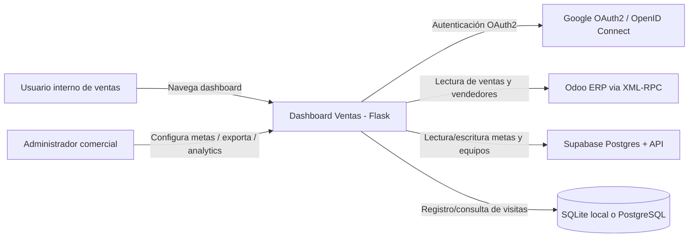
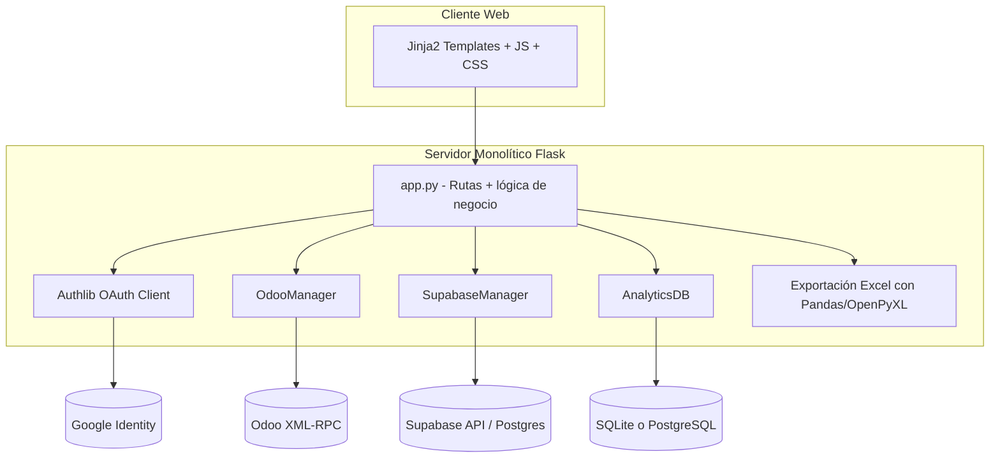
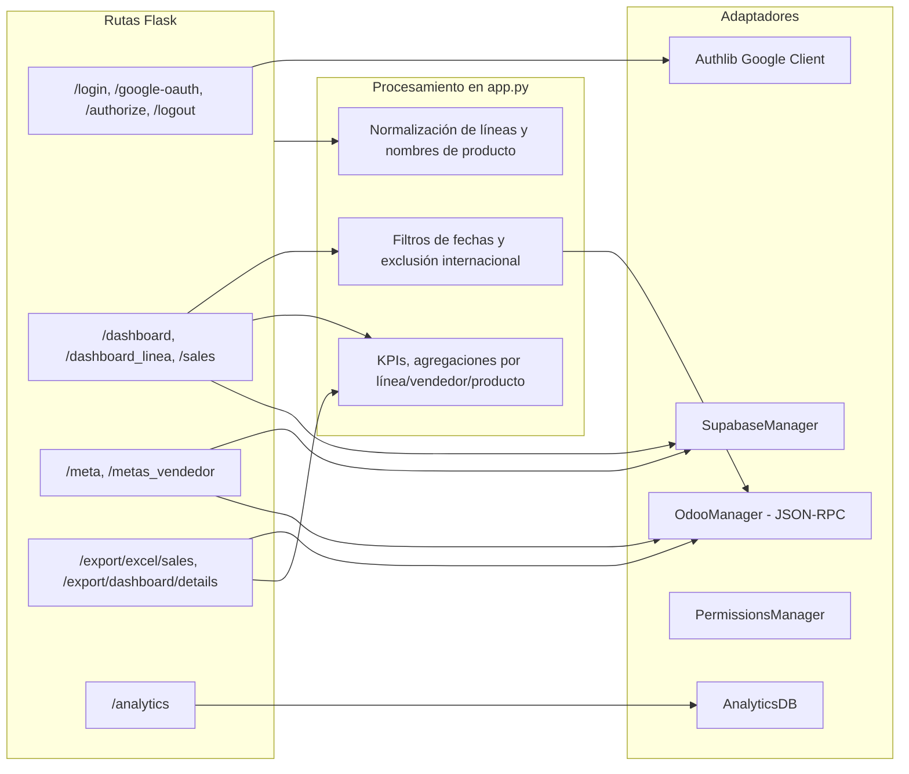

# Arquitectura de Alto Nivel — Dashboard Ventas

## 1. Resumen ejecutivo

Este repositorio implementa una aplicación web monolítica en Flask para:

- visualizar métricas de ventas desde Odoo,
- administrar metas comerciales (por línea y por vendedor) en Supabase,
- registrar analítica de uso (SQLite en local / PostgreSQL en producción),
- autenticar usuarios con Google OAuth2 y control de acceso por lista permitida.

El diseño prioriza **entrega rápida y operación simple** sobre separación estricta por capas.

---

## 2. Alcance funcional

### Dominios principales

1. **Autenticación y autorización**
   - Login con Google OAuth2.
   - Sistema de permisos granular con PermissionsManager (SQLite).
   - Roles: admin_full, admin_export, analytics_viewer.
   - Timeout dual de sesión: 15 min inactividad + 8 horas absoluto.
   - Whitelist por correo para acceso (allowed_users.json).

2. **Ventas operativas**
   - Consulta de líneas de venta, filtros, exclusión de exportaciones, agregaciones y KPIs.
   - Integración Odoo vía JSON-RPC (migrado desde XML-RPC).

3. **Metas comerciales**
   - Metas por línea comercial.
   - Metas por vendedor + asignación de vendedores a equipos.

4. **Exportaciones**
   - Exportación de detalle de ventas a Excel (con formato).
   - Control de permisos por rol.

5. **Analytics de uso**
   - Registro de visitas por middleware y dashboard de estadísticas.

6. **Seguridad**
   - Headers de seguridad (CSP, HSTS, X-Frame-Options).
   - Protección SQL injection (queries parametrizadas).
   - Sanitización de inputs y validación de datos.

---

## 3. C4 — Nivel 1 (System Context)

### Límites del sistema

- El sistema **no** es fuente maestra de ventas: consume Odoo.
- El sistema **sí** es fuente operativa de metas (persistidas en Supabase).
- El sistema **sí** mantiene su telemetría de uso en una base separada.

---

## 4. C4 — Nivel 2 (Containers)

### Observaciones de contenedores

- Es un **single deployable unit** (`app.py`) con managers de integración.
- No existe API REST separada para frontend; el render es server-side con Jinja2.
- El frontend usa JS mínimo y librerías CDN para gráficos/exportes visuales.

---

## 5. C4 — Nivel 3 (Componentes del contenedor Flask)

### Responsabilidades clave

- `app.py`: orquestación, permisos, transformaciones, render y middleware de seguridad.
- `odoo_manager.py`: acceso JSON-RPC a Odoo y extracción de ventas/vendedores/filtros.
- `supabase_manager.py`: persistencia de metas/equipos con operaciones de lectura/escritura.
- `analytics_db.py`: almacenamiento y consulta de eventos de navegación.
- `permissions_manager.py`: sistema de permisos granular por rol y funcionalidad.

---

## 6. Decisiones arquitectónicas (ADRs resumidas)

### ADR-01 — Monolito Flask con render server-side

- **Decisión**: mantener app monolítica (rutas + lógica + render).
- **Motivación**: reducir complejidad operativa y acelerar iteración funcional.
- **Consecuencia**: menor costo inicial; mayor riesgo de acoplamiento y crecimiento no controlado del archivo principal.

### ADR-02 — Integración Odoo por XML-RPC

- **Decisión**: consumir Odoo usando `xmlrpc.client` con timeout configurable.
- **Motivación**: compatibilidad directa con endpoints estándar de Odoo.
- **Consecuencia**: dependencia de latencia/red y payloads amplios; lógica de adaptación en aplicación.

### ADR-03 — Supabase como persistencia de metas

- **Decisión**: migrar de enfoque tipo hoja de cálculo a tablas en Supabase.
- **Motivación**: persistencia centralizada, operaciones `upsert`, disponibilidad multiusuario.
- **Consecuencia**: mejora consistencia; añade dependencia externa y gestión de claves.

### ADR-04 — Analytics híbrido SQLite/PostgreSQL

- **Decisión**: usar SQLite local cuando `DATABASE_URL` está vacío; PostgreSQL en producción.
- **Motivación**: facilitar entorno local sin infraestructura extra.
- **Consecuencia**: paridad parcial entre entornos y potenciales diferencias de SQL/fechas.

### ADR-05 — Autenticación Google + autorización por whitelist

- **Decisión**: OAuth2 para identidad y listas de correos para autorización.
- **Motivación**: delegar autenticación a Google y mantener control de acceso simple.
- **Consecuencia**: implementación rápida; autorización dispersa entre whitelist y listas de admins hardcodeadas.

### ADR-06 — Estrategia de resiliencia “modo degradado”

- **Decisión**: usar fallback/stub si Odoo no está disponible en inicialización.
- **Motivación**: permitir que la app levante aunque una integración falle.
- **Consecuencia**: mejora disponibilidad percibida; puede ocultar fallas de datos si no hay observabilidad fuerte.

### ADR-07 — Cálculo de KPIs en capa web

- **Decisión**: realizar agregaciones y reglas de negocio principalmente en `app.py`.
- **Motivación**: velocidad de desarrollo y trazabilidad local del cálculo.
- **Consecuencia**: duplicación potencial de reglas y menor reutilización.

### ADR-08 — Exportes Excel en memoria

- **Decisión**: generar archivos con Pandas/OpenPyXL y `BytesIO`.
- **Motivación**: evitar almacenamiento temporal en disco y entregar descarga inmediata.
- **Consecuencia**: simple para volúmenes moderados; puede impactar memoria en exportaciones grandes.

### ADR-09 — Migración a JSON-RPC para Odoo (Marzo 2026)

- **Decisión**: migrar de XML-RPC a JSON-RPC para comunicación con Odoo.
- **Motivación**: evitar bugs conocidos en módulos de auditoría Odoo, mejor rendimiento y payloads más pequeños.
- **Consecuencia**: compatibilidad con Odoo 16+, más fácil de debuggear, reduce latencia.

### ADR-10 — Sistema de permisos granular con SQLite (Marzo 2026)

- **Decisión**: implementar PermissionsManager con base SQLite para control de acceso.
- **Motivación**: centralizar permisos que estaban hardcodeados en múltiples rutas, facilitar gestión de roles.
- **Consecuencia**: permisos persistentes, auditoría de cambios, reduce duplicación de código.

### ADR-11 — Timeout dual de sesión (Marzo 2026)

- **Decisión**: implementar doble timeout: 15 minutos de inactividad + 8 horas absoluto desde login.
- **Motivación**: cumplir con mejores prácticas de seguridad (OWASP A01), proteger contra sesiones abandonadas.
- **Consecuencia**: mejora seguridad, requiere tracking de last_activity_time en sesión.

### ADR-12 — Security headers y CSP (Marzo 2026)

- **Decisión**: implementar Content-Security-Policy, HSTS, X-Frame-Options y otros headers.
- **Motivación**: protección contra XSS, clickjacking, MITM (OWASP A04).
- **Consecuencia**: CSP requiere configuración cuidadosa para CDNs externos (Google, jsdelivr, cdnjs).

---

## 7. Trade-offs principales

### 7.1 Simplicidad vs escalabilidad

- **Ganancia**: arquitectura fácil de entender, desplegar y modificar por un equipo pequeño.
- **Costo**: `app.py` concentra demasiada responsabilidad (rutas + reglas + transformación + permisos).

### 7.2 Tiempo de entrega vs robustez de seguridad/autorización

- **Ganancia**: acceso controlado rápidamente con listas de emails.
- **Costo**: control de roles no centralizado; cambios de permisos requieren despliegue/edición manual.

### 7.3 Flexibilidad de integración vs consistencia de dominio

- **Ganancia**: se adapta rápido a estructuras de Odoo y Supabase.
- **Costo**: normalizaciones y mapeos repartidos en varias rutas.

### 7.4 Operación local simple vs paridad de entornos

- **Ganancia**: desarrollo local sin dependencia de PostgreSQL.
- **Costo**: divergencias entre SQLite y PostgreSQL (tipos, funciones fecha/hora, rendimiento).

### 7.5 Entrega de datos en tiempo real vs costo de consulta

- **Ganancia**: datos de ventas frescos al consultar Odoo.
- **Costo**: tiempos de respuesta variables y presión sobre integración externa sin capa de cache.

---

## 8. Riesgos y deuda técnica observada

### Resuelto recientemente (Marzo 2026)

1. ~~**Permisos hardcodeados en múltiples rutas**~~ ✅
   - **RESUELTO**: Implementado PermissionsManager con SQLite.
   - Sistema centralizado de roles y permisos.
   - Migración completada de listas hardcodeadas.

2. ~~**SQL Injection en queries**~~ ✅
   - **RESUELTO**: 6/6 queries parametrizadas correctamente.
   - Eliminado uso de f-strings en SQL.
   - Score OWASP A03: 4/10 → 7/10.

3. ~~**Ausencia de timeout de sesión**~~ ✅
   - **RESUELTO**: Timeout dual implementado (inactividad + absoluto).
   - Cumple OWASP A01 - Broken Authentication.

4. ~~**Headers de seguridad ausentes**~~ ✅
   - **RESUELTO**: CSP, HSTS, X-Frame-Options implementados.
   - Score OWASP A04: 6/10 → 7/10.

### Pendientes

5. **Archivo principal muy extenso**
   - `app.py` supera ampliamente el tamaño típico para mantener cohesión de responsabilidades.
   - Candidato para blueprints Flask.

6. **Duplicación de métodos en analytics**
   - `analytics_db.py` contiene redefiniciones de métodos (`get_connection`, consultas agregadas, etc.).

7. **Secretos sensibles en `.env` local**
   - Requiere rotación y política de manejo segura por entorno.
   - **Nota**: Archivo .env con BOM UTF-8 causó problemas de carga (resuelto).

8. **Reglas de negocio repetidas**
   - Filtros de "VENTA INTERNACIONAL" y normalizaciones aparecen en varios endpoints.

---

## 9. Roadmap arquitectónico sugerido (incremental)

1. **Modularizar `app.py` por blueprints**
   - `auth`, `dashboard`, `metas`, `exports`, `analytics`.

2. **Centralizar autorización**
   - decorator común para roles/permisos y fuente única de configuración.

3. **Extraer servicios de dominio**
   - capa `services/` para cálculos KPI y normalizaciones reutilizables.

4. **Resolver duplicación en `analytics_db.py`**
   - dejar una sola implementación por método con pruebas básicas.

5. **Añadir cache de lecturas Odoo críticas**
   - cache corto por mes/filtro para reducir latencia percibida.

---

## 10. Mapa rápido de componentes del repo

- `app.py`: entrypoint Flask, rutas, middleware de seguridad, timeout de sesión, cálculo y render.
- `src/odoo_manager.py`: consultas JSON-RPC a Odoo (migrado desde XML-RPC).
- `src/supabase_manager.py`: CRUD de metas/equipos en Supabase.
- `src/analytics_db.py`: persistencia y agregados de analytics.
- `src/permissions_manager.py`: sistema de permisos granular por rol (SQLite).
- `templates/`: vistas Jinja2 por módulo funcional.
- `static/`: estilos y JS auxiliar.
- `tests/`: tests unitarios y de integración (pytest).
- `docs/`: documentación de arquitectura, seguridad y PRD.
- `security_reports/`: auditorías de seguridad OWASP Top 10.

---

## 11. Conclusión

La arquitectura actual es **efectiva para un producto interno orientado a negocio**, con fuerte foco en velocidad de entrega y operación simple. El principal límite es el acoplamiento en la capa web: modularizar responsabilidades, unificar autorización y limpiar duplicaciones ofrecería la mayor mejora de mantenibilidad sin rehacer el sistema.
