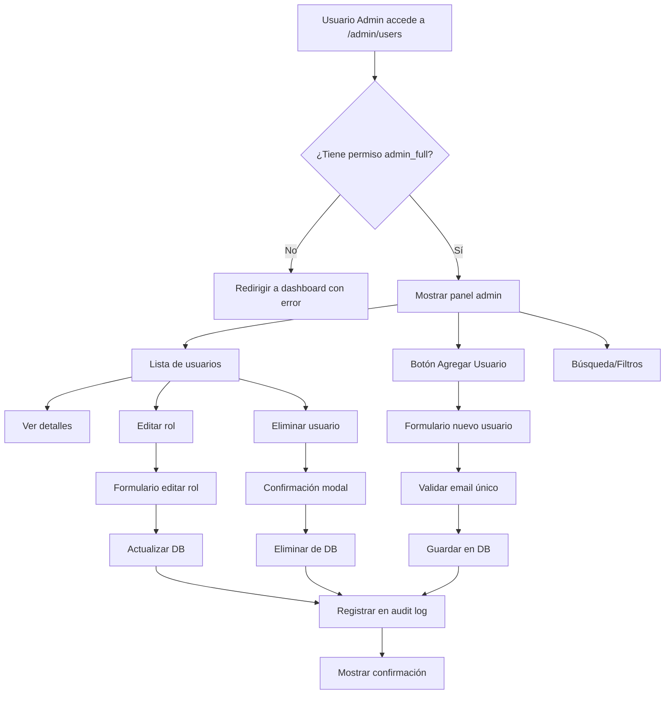

# Plan de Implementación: Módulo de Administración de Permisos (Permissions Administration Module)
## Sistema Web para Gestión de Usuarios y Roles sin Tocar Código (Web System for User and Role Management without Code Changes)

> 📅 **Fecha de creación (Creation date)**: 24 de marzo de 2026  
> 🎯 **Objetivo (Objective)**: Panel administrativo web para gestionar usuarios y permisos dinámicamente  
> ⏱️ **Tiempo estimado (Estimated time)**: 12-16 horas de desarrollo  
> 🔒 **Prioridad de seguridad (Security priority)**: ALTA - Solo accesible por admin_full

---

## 📋 Índice (Table of Contents)

1. [Análisis del Estado Actual](#1-análisis-del-estado-actual)
2. [Arquitectura Propuesta](#2-arquitectura-propuesta)
3. [Plan de Implementación Fase por Fase](#3-plan-de-implementación-fase-por-fase)
4. [Especificación Técnica Detallada](#4-especificación-técnica-detallada)
5. [Seguridad y Validaciones](#5-seguridad-y-validaciones)
6. [Testing y Validación](#6-testing-y-validación)
7. [Roadmap de Implementación](#7-roadmap-de-implementación)

---

## 1. Análisis del Estado Actual (Current State Analysis)

### 1.1 Sistema Existente (Existing System)

**✅ Ya implementado (Already implemented)**:
```python
# src/permissions_manager.py
class PermissionsManager:
    ROLE_PERMISSIONS = {
        'admin_full': ['view_dashboard', 'view_analytics', 'edit_targets', 'export_data'],
        'admin_export': ['view_dashboard', 'export_data'],
        'analytics_viewer': ['view_dashboard', 'view_analytics'],
        'user_basic': ['view_dashboard']
    }
    
    def add_user(email, role)          # ✅ Existe
    def has_permission(email, perm)    # ✅ Existe
    def is_admin(email)                # ✅ Existe
    def get_user_role(email)           # ✅ Existe
```

**Base de datos SQLite**:
```sql
-- Table: user_permissions
CREATE TABLE user_permissions (
    user_email TEXT PRIMARY KEY,
    role TEXT NOT NULL,
    created_at TIMESTAMP,
    updated_at TIMESTAMP
);
```

### 1.2 Problema Actual (Current Problem)

❌ **Para agregar usuarios, el administrador debe**:
1. Conectarse al servidor
2. Abrir Python REPL o crear script
3. Ejecutar: `permissions_manager.add_user('nuevo@email.com', 'user_basic')`
4. No hay auditoría de quién hizo qué cambio
5. No hay validación visual
6. Propenso a errores de sintaxis

### 1.3 Solución Propuesta (Proposed Solution)

✅ **Panel web administrativo en `/admin/users` que permita**:
- 📋 Ver listado completo de usuarios con sus roles
- ➕ Agregar nuevos usuarios con validación de email
- ✏️ Editar roles de usuarios existentes
- 🗑️ Eliminar usuarios (con confirmación)
- 📊 Ver historial de cambios (audit log)
- 🔍 Buscar y filtrar usuarios por rol
- 📤 Exportar lista de usuarios a CSV

---

## 2. Arquitectura Propuesta (Proposed Architecture)

### 2.1 Estructura de Archivos (File Structure)

```plaintext
Dashboard-Ventas-Backup/
├── app.py                          # Rutas principales (agregar rutas admin)
├── src/
│   ├── permissions_manager.py      # ✅ Ya existe (ampliar)
│   ├── admin_permissions_service.py # 🆕 Lógica de negocio admin
│   └── audit_logger.py             # 🆕 Registro de cambios
├── templates/
│   └── admin/
│       ├── users_list.html         # 🆕 Lista de usuarios
│       ├── user_edit.html          # 🆕 Editar usuario
│       └── user_add.html           # 🆕 Agregar usuario
├── static/
│   ├── css/
│   │   └── admin.css               # 🆕 Estilos del panel admin
│   └── js/
│       └── admin_users.js          # 🆕 Validación y confirmaciones
└── tests/
    └── test_admin_permissions.py   # 🆕 Tests del módulo admin
```

### 2.2 Diagrama de Flujo (Flow Diagram)



---

## 3. Plan de Implementación Fase por Fase (Phase-by-Phase Implementation Plan)

### 📦 Fase 1: Base del Sistema Admin (2-3 horas)

**Objetivo**: Crear estructura básica y sistema de auditoría

**Tareas**:

1. **Crear `src/audit_logger.py`**
   ```python
   # Sistema de auditoría de cambios
   class AuditLogger:
       def log_user_created(admin_email, new_user_email, role)
       def log_user_updated(admin_email, user_email, old_role, new_role)
       def log_user_deleted(admin_email, user_email)
       def get_recent_logs(limit=50)
   ```

2. **Ampliar `src/permissions_manager.py`**
   ```python
   # Agregar métodos nuevos
   def update_user_role(email, new_role)  # 🆕
   def delete_user(email)                 # 🆕
   def get_all_users()                    # 🆕
   def search_users(query)                # 🆕
   def get_users_by_role(role)            # 🆕
   ```

3. **Crear tabla de auditoría**
   ```sql
   CREATE TABLE audit_log (
       id INTEGER PRIMARY KEY AUTOINCREMENT,
       admin_email TEXT NOT NULL,
       action TEXT NOT NULL, -- 'CREATE', 'UPDATE', 'DELETE'
       target_user_email TEXT NOT NULL,
       old_value TEXT,
       new_value TEXT,
       timestamp TIMESTAMP DEFAULT CURRENT_TIMESTAMP,
       ip_address TEXT
   );
   ```

**Criterio de éxito**: 
- ✅ Todos los métodos CRUD funcionan
- ✅ Tests unitarios pasan (test_permissions_manager.py)
- ✅ Logs se guardan correctamente

---

### 🎨 Fase 2: Frontend - Lista de Usuarios (3-4 horas)

**Objetivo**: Interfaz para ver y buscar usuarios

**Tareas**:

1. **Crear ruta `/admin/users` en app.py**
   ```python
   @app.route('/admin/users')
   @login_required
   def admin_users():
       # Validar que usuario es admin_full
       if not permissions_manager.is_admin(session['username']):
           flash('Acceso denegado. Solo administradores.', 'danger')
           return redirect(url_for('dashboard'))
       
       users = permissions_manager.get_all_users()
       audit_logs = audit_logger.get_recent_logs(limit=20)
       
       return render_template('admin/users_list.html',
                              users=users,
                              audit_logs=audit_logs,
                              is_admin=True)
   ```

2. **Crear `templates/admin/users_list.html`**
   ```html
   <!-- Tabla con DataTables para búsqueda y paginación -->
   <table id="usersTable" class="table table-striped">
       <thead>
           <tr>
               <th>Email</th>
               <th>Rol</th>
               <th>Permisos</th>
               <th>Creado</th>
               <th>Actualizado</th>
               <th>Acciones</th>
           </tr>
       </thead>
       <tbody>
           
           <tr>
               <td>{{ user.email }}</td>
               <td><span class="badge badge-{{ user.role_class }}">{{ user.role_display }}</span></td>
               <td>
                   
                   <span class="badge badge-secondary">{{ perm }}</span>
                   
               </td>
               <td>{{ user.created_at | date }}</td>
               <td>{{ user.updated_at | date }}</td>
               <td>
                   <a href="{{ url_for('admin_edit_user', email=user.email) }}" class="btn btn-sm btn-primary">
                       <i class="fas fa-edit"></i> Editar
                   </a>
                   <button onclick="deleteUser('{{ user.email }}')" class="btn btn-sm btn-danger">
                       <i class="fas fa-trash"></i> Eliminar
                   </button>
               </td>
           </tr>
           
       </tbody>
   </table>
   ```

3. **Agregar búsqueda y filtros**
   ```javascript
   // static/js/admin_users.js
   $(document).ready(function() {
       $('#usersTable').DataTable({
           language: {
               url: '//cdn.datatables.net/plug-ins/1.13.4/i18n/es-ES.json'
           },
           order: [[4, 'desc']], // Ordenar por fecha actualización
           columnDefs: [
               { targets: 5, orderable: false } // No ordenar columna Acciones
           ]
       });
       
       // Filtro por rol
       $('#roleFilter').on('change', function() {
           var role = $(this).val();
           $('#usersTable').DataTable().column(1).search(role).draw();
       });
   });
   ```

**Criterio de éxito**:
- ✅ Tabla muestra todos los usuarios
- ✅ Búsqueda funciona correctamente
- ✅ Filtro por rol funciona
- ✅ Botones redirigen correctamente

---

### ➕ Fase 3: Agregar Usuarios (2-3 horas)

**Objetivo**: Formulario para crear nuevos usuarios

**Tareas**:

1. **Crear ruta POST `/admin/users/add`**
   ```python
   @app.route('/admin/users/add', methods=['GET', 'POST'])
   @login_required
   def admin_add_user():
       if not permissions_manager.is_admin(session['username']):
           return jsonify({'error': 'Unauthorized'}), 403
       
       if request.method == 'POST':
           email = request.form.get('email').strip().lower()
           role = request.form.get('role')
           
           # Validaciones
           if not email or '@' not in email:
               flash('Email inválido', 'danger')
               return redirect(url_for('admin_users'))
           
           if role not in PermissionsManager.ROLE_PERMISSIONS:
               flash('Rol inválido', 'danger')
               return redirect(url_for('admin_users'))
           
           # Verificar que no existe
           if permissions_manager.get_user_role(email):
               flash(f'Usuario {email} ya existe', 'warning')
               return redirect(url_for('admin_users'))
           
           # Crear usuario
           success = permissions_manager.add_user(email, role)
           if success:
               # Log de auditoría
               audit_logger.log_user_created(
                   admin_email=session['username'],
                   new_user_email=email,
                   role=role,
                   ip_address=request.remote_addr
               )
               flash(f'Usuario {email} creado con rol {role}', 'success')
           else:
               flash('Error al crear usuario', 'danger')
           
           return redirect(url_for('admin_users'))
       
       return render_template('admin/user_add.html',
                              roles=PermissionsManager.ROLE_PERMISSIONS)
   ```

2. **Crear `templates/admin/user_add.html`**
   ```html
   <form method="POST" action="{{ url_for('admin_add_user') }}" id="addUserForm">
       <div class="form-group">
           <label for="email">Email del Usuario *</label>
           <input type="email" 
                  class="form-control" 
                  id="email" 
                  name="email" 
                  required
                  placeholder="usuario@agrovetmarket.com"
                  pattern="[a-z0-9._%+-]+@[a-z0-9.-]+\.[a-z]{2,}$">
           <small class="form-text text-muted">
               Debe ser un email corporativo válido
           </small>
       </div>
       
       <div class="form-group">
           <label for="role">Rol *</label>
           <select class="form-control" id="role" name="role" required>
               <option value="">-- Seleccionar Rol --</option>
               
               <option value="{{ role_key }}">
                   {{ role_key | replace('_', ' ') | title }} 
                   ({{ permissions | length }} permisos)
               </option>
               
           </select>
       </div>
       
       <!-- Mostrar permisos dinámicamente según rol seleccionado -->
       <div id="permissionsPreview" class="alert alert-info" style="display:none;">
           <strong>Permisos incluidos:</strong>
           <ul id="permissionsList"></ul>
       </div>
       
       <button type="submit" class="btn btn-primary">
           <i class="fas fa-user-plus"></i> Crear Usuario
       </button>
       <a href="{{ url_for('admin_users') }}" class="btn btn-secondary">Cancelar</a>
   </form>
   ```

3. **Validación JavaScript**
   ```javascript
   // Mostrar permisos según rol seleccionado
   $('#role').on('change', function() {
       const role = $(this).val();
       const permissions = {
           'admin_full': ['view_dashboard', 'view_analytics', 'edit_targets', 'export_data'],
           'admin_export': ['view_dashboard', 'export_data'],
           'analytics_viewer': ['view_dashboard', 'view_analytics'],
           'user_basic': ['view_dashboard']
       };
       
       if (role && permissions[role]) {
           const permList = permissions[role].map(p => `<li>${p}</li>`).join('');
           $('#permissionsList').html(permList);
           $('#permissionsPreview').show();
       } else {
           $('#permissionsPreview').hide();
       }
   });
   
   // Validar email corporativo
   $('#addUserForm').on('submit', function(e) {
       const email = $('#email').val();
       const validDomains = ['@agrovetmarket.com', '@company.com']; // Configurar según dominio
       
       const isValid = validDomains.some(domain => email.endsWith(domain));
       if (!isValid) {
           e.preventDefault();
           alert('Solo se permiten emails corporativos');
           return false;
       }
   });
   ```

**Criterio de éxito**:
- ✅ Formulario valida email correctamente
- ✅ No permite duplicados
- ✅ Muestra permisos del rol seleccionado
- ✅ Se registra en audit log

---

### ✏️ Fase 4: Editar y Eliminar Usuarios (2-3 horas)

**Objetivo**: Modificar roles existentes y eliminar usuarios

**Tareas**:

1. **Ruta `/admin/users/edit/<email>`**
   ```python
   @app.route('/admin/users/edit/<email>', methods=['GET', 'POST'])
   @login_required
   def admin_edit_user(email):
       if not permissions_manager.is_admin(session['username']):
           return jsonify({'error': 'Unauthorized'}), 403
       
       user = permissions_manager.get_user_details(email)
       if not user:
           flash('Usuario no encontrado', 'danger')
           return redirect(url_for('admin_users'))
       
       if request.method == 'POST':
           new_role = request.form.get('role')
           old_role = user['role']
           
           if new_role == old_role:
               flash('No hay cambios que guardar', 'info')
               return redirect(url_for('admin_users'))
           
           # Prevenir que admin se quite sus propios permisos
           if email == session['username'] and new_role != 'admin_full':
               flash('No puedes cambiar tu propio rol de admin', 'danger')
               return redirect(url_for('admin_users'))
           
           success = permissions_manager.update_user_role(email, new_role)
           if success:
               audit_logger.log_user_updated(
                   admin_email=session['username'],
                   user_email=email,
                   old_role=old_role,
                   new_role=new_role,
                   ip_address=request.remote_addr
               )
               flash(f'Rol de {email} actualizado a {new_role}', 'success')
           else:
               flash('Error al actualizar usuario', 'danger')
           
           return redirect(url_for('admin_users'))
       
       return render_template('admin/user_edit.html', 
                              user=user,
                              roles=PermissionsManager.ROLE_PERMISSIONS)
   ```

2. **Ruta `/admin/users/delete/<email>` (DELETE o POST)**
   ```python
   @app.route('/admin/users/delete/<email>', methods=['POST'])
   @login_required
   def admin_delete_user(email):
       if not permissions_manager.is_admin(session['username']):
           return jsonify({'error': 'Unauthorized'}), 403
       
       # No permitir auto-eliminación
       if email == session['username']:
           return jsonify({'error': 'No puedes eliminar tu propio usuario'}), 400
       
       user = permissions_manager.get_user_details(email)
       if not user:
           return jsonify({'error': 'Usuario no encontrado'}), 404
       
       success = permissions_manager.delete_user(email)
       if success:
           audit_logger.log_user_deleted(
               admin_email=session['username'],
               user_email=email,
               ip_address=request.remote_addr
           )
           return jsonify({'message': f'Usuario {email} eliminado correctamente'}), 200
       else:
           return jsonify({'error': 'Error al eliminar usuario'}), 500
   ```

3. **Modal de confirmación para eliminar**
   ```javascript
   function deleteUser(email) {
       Swal.fire({
           title: '¿Eliminar usuario?',
           html: `Se eliminará permanentemente el usuario:<br><strong>${email}</strong>`,
           icon: 'warning',
           showCancelButton: true,
           confirmButtonColor: '#d33',
           cancelButtonColor: '#3085d6',
           confirmButtonText: 'Sí, eliminar',
           cancelButtonText: 'Cancelar'
       }).then((result) => {
           if (result.isConfirmed) {
               fetch(`/admin/users/delete/${email}`, {
                   method: 'POST',
                   headers: {
                       'Content-Type': 'application/json'
                   }
               })
               .then(response => response.json())
               .then(data => {
                   if (data.message) {
                       Swal.fire('Eliminado', data.message, 'success')
                           .then(() => location.reload());
                   } else {
                       Swal.fire('Error', data.error, 'error');
                   }
               })
               .catch(error => {
                   Swal.fire('Error', 'Error al eliminar usuario', 'error');
               });
           }
       });
   }
   ```

**Criterio de éxito**:
- ✅ No permite que admin edite su propio rol
- ✅ No permite auto-eliminación
- ✅ Confirmación antes de eliminar
- ✅ Todas las acciones se auditan

---

### 📊 Fase 5: Dashboard de Auditoría (2-3 horas)

**Objetivo**: Ver historial de cambios

**Tareas**:

1. **Ruta `/admin/audit-log`**
   ```python
   @app.route('/admin/audit-log')
   @login_required
   def admin_audit_log():
       if not permissions_manager.is_admin(session['username']):
           return jsonify({'error': 'Unauthorized'}), 403
       
       # Filtros opcionales
       days = request.args.get('days', 30, type=int)
       action_filter = request.args.get('action', '')
       
       logs = audit_logger.get_filtered_logs(
           days=days,
           action=action_filter
       )
       
       # Estadísticas
       stats = {
           'total_users': permissions_manager.count_users(),
           'total_admins': permissions_manager.count_admins(),
           'changes_last_week': audit_logger.count_changes_last_week()
       }
       
       return render_template('admin/audit_log.html',
                              logs=logs,
                              stats=stats)
   ```

2. **Vista de auditoría**
   ```html
   <!-- templates/admin/audit_log.html -->
   <div class="row mb-4">
       <div class="col-md-4">
           <div class="card text-white bg-primary">
               <div class="card-body">
                   <h5 class="card-title">Total Usuarios</h5>
                   <h2>{{ stats.total_users }}</h2>
               </div>
           </div>
       </div>
       <div class="col-md-4">
           <div class="card text-white bg-success">
               <div class="card-body">
                   <h5 class="card-title">Administradores</h5>
                   <h2>{{ stats.total_admins }}</h2>
               </div>
           </div>
       </div>
       <div class="col-md-4">
           <div class="card text-white bg-info">
               <div class="card-body">
                   <h5 class="card-title">Cambios (Última Semana)</h5>
                   <h2>{{ stats.changes_last_week }}</h2>
               </div>
           </div>
       </div>
   </div>
   
   <table class="table table-hover">
       <thead>
           <tr>
               <th>Fecha/Hora</th>
               <th>Administrador</th>
               <th>Acción</th>
               <th>Usuario Afectado</th>
               <th>Cambios</th>
               <th>IP</th>
           </tr>
       </thead>
       <tbody>
           
           <tr>
               <td>{{ log.timestamp | datetime }}</td>
               <td>{{ log.admin_email }}</td>
               <td>
                   <span class="badge badge-{{ log.action_class }}">
                       {{ log.action }}
                   </span>
               </td>
               <td>{{ log.target_user_email }}</td>
               <td>
                   
                   {{ log.old_value }} → {{ log.new_value }}
                   
                   {{ log.new_value }}
                   
               </td>
               <td><small>{{ log.ip_address }}</small></td>
           </tr>
           
       </tbody>
   </table>
   ```

**Criterio de éxito**:
- ✅ Muestra todos los cambios con detalles
- ✅ Filtros por fecha y tipo de acción funcionan
- ✅ Estadísticas se calculan correctamente

---

## 4. Especificación Técnica Detallada (Detailed Technical Specification)

### 4.1 Ampliaciones de `permissions_manager.py`

```python
class PermissionsManager:
    # ... métodos existentes ...
    
    def update_user_role(self, user_email: str, new_role: str) -> bool:
        """
        Actualiza el rol de un usuario existente.
        
        Args:
            user_email: Email del usuario
            new_role: Nuevo rol a asignar
        
        Returns:
            bool: True si se actualizó correctamente
        """
        if new_role not in self.ROLE_PERMISSIONS:
            logger.error(f"Rol inválido: {new_role}")
            return False
        
        try:
            with self.get_connection() as conn:
                cursor = conn.cursor()
                cursor.execute("""
                    UPDATE user_permissions 
                    SET role = ?, updated_at = CURRENT_TIMESTAMP
                    WHERE user_email = ?
                """, (new_role, user_email))
                
                if cursor.rowcount == 0:
                    logger.warning(f"Usuario no encontrado: {user_email}")
                    return False
                
                logger.info(f"Rol actualizado: {user_email} → {new_role}")
                return True
        except Exception as e:
            logger.error(f"Error al actualizar rol: {e}", exc_info=True)
            return False
    
    def delete_user(self, user_email: str) -> bool:
        """
        Elimina un usuario del sistema de permisos.
        
        Args:
            user_email: Email del usuario a eliminar
        
        Returns:
            bool: True si se eliminó correctamente
        """
        try:
            with self.get_connection() as conn:
                cursor = conn.cursor()
                cursor.execute("""
                    DELETE FROM user_permissions 
                    WHERE user_email = ?
                """, (user_email,))
                
                if cursor.rowcount == 0:
                    logger.warning(f"Usuario no encontrado para eliminar: {user_email}")
                    return False
                
                logger.info(f"Usuario eliminado: {user_email}")
                return True
        except Exception as e:
            logger.error(f"Error al eliminar usuario: {e}", exc_info=True)
            return False
    
    def get_all_users(self) -> List[Dict]:
        """
        Obtiene lista de todos los usuarios con sus detalles.
        
        Returns:
            List[Dict]: Lista de usuarios con email, role, permisos, fechas
        """
        try:
            with self.get_connection() as conn:
                cursor = conn.cursor()
                cursor.execute("""
                    SELECT user_email, role, created_at, updated_at
                    FROM user_permissions
                    ORDER BY updated_at DESC
                """)
                
                users = []
                for row in cursor.fetchall():
                    users.append({
                        'email': row['user_email'],
                        'role': row['role'],
                        'role_display': row['role'].replace('_', ' ').title(),
                        'permissions': self.ROLE_PERMISSIONS[row['role']],
                        'created_at': row['created_at'],
                        'updated_at': row['updated_at'],
                        'role_class': self._get_role_badge_class(row['role'])
                    })
                
                return users
        except Exception as e:
            logger.error(f"Error al obtener usuarios: {e}", exc_info=True)
            return []
    
    def search_users(self, query: str) -> List[Dict]:
        """Busca usuarios por email"""
        try:
            with self.get_connection() as conn:
                cursor = conn.cursor()
                cursor.execute("""
                    SELECT user_email, role, created_at, updated_at
                    FROM user_permissions
                    WHERE user_email LIKE ?
                    ORDER BY user_email
                """, (f'%{query}%',))
                
                return [dict(row) for row in cursor.fetchall()]
        except Exception as e:
            logger.error(f"Error en búsqueda: {e}", exc_info=True)
            return []
    
    def get_users_by_role(self, role: str) -> List[Dict]:
        """Filtra usuarios por rol específico"""
        try:
            with self.get_connection() as conn:
                cursor = conn.cursor()
                cursor.execute("""
                    SELECT user_email, role, created_at, updated_at
                    FROM user_permissions
                    WHERE role = ?
                    ORDER BY user_email
                """, (role,))
                
                return [dict(row) for row in cursor.fetchall()]
        except Exception as e:
            logger.error(f"Error al filtrar por rol: {e}", exc_info=True)
            return []
    
    def get_user_details(self, user_email: str) -> Optional[Dict]:
        """Obtiene detalles completos de un usuario"""
        try:
            with self.get_connection() as conn:
                cursor = conn.cursor()
                cursor.execute("""
                    SELECT user_email, role, created_at, updated_at
                    FROM user_permissions
                    WHERE user_email = ?
                """, (user_email,))
                
                row = cursor.fetchone()
                if row:
                    return {
                        'email': row['user_email'],
                        'role': row['role'],
                        'permissions': self.ROLE_PERMISSIONS[row['role']],
                        'created_at': row['created_at'],
                        'updated_at': row['updated_at']
                    }
                return None
        except Exception as e:
            logger.error(f"Error al obtener detalles: {e}", exc_info=True)
            return None
    
    def count_users(self) -> int:
        """Cuenta total de usuarios"""
        try:
            with self.get_connection() as conn:
                cursor = conn.cursor()
                cursor.execute("SELECT COUNT(*) as count FROM user_permissions")
                return cursor.fetchone()['count']
        except Exception as e:
            logger.error(f"Error al contar usuarios: {e}", exc_info=True)
            return 0
    
    def count_admins(self) -> int:
        """Cuenta total de administradores"""
        try:
            with self.get_connection() as conn:
                cursor = conn.cursor()
                cursor.execute("""
                    SELECT COUNT(*) as count 
                    FROM user_permissions 
                    WHERE role = 'admin_full'
                """)
                return cursor.fetchone()['count']
        except Exception as e:
            logger.error(f"Error al contar admins: {e}", exc_info=True)
            return 0
    
    @staticmethod
    def _get_role_badge_class(role: str) -> str:
        """Retorna clase CSS para badge según rol"""
        badge_classes = {
            'admin_full': 'danger',
            'admin_export': 'warning',
            'analytics_viewer': 'info',
            'user_basic': 'secondary'
        }
        return badge_classes.get(role, 'secondary')
```

### 4.2 Crear `src/audit_logger.py`

```python
"""
audit_logger.py - Sistema de auditoría de cambios de permisos

Registra todas las operaciones CRUD sobre usuarios y permisos
"""

import sqlite3
from contextlib import contextmanager
from typing import List, Dict, Optional
from datetime import datetime, timedelta
from src.logging_config import get_logger

logger = get_logger(__name__)


class AuditLogger:
    """
    Logger de auditoría para cambios en permisos de usuario.
    
    Registra:
    - Creación de usuarios
    - Actualización de roles
    - Eliminación de usuarios
    - IP, timestamp, admin que realizó el cambio
    """
    
    def __init__(self, db_path='permissions.db'):
        """Inicializa el audit logger"""
        self.db_path = db_path
        self._init_audit_table()
        logger.info(f"AuditLogger inicializado con DB: {db_path}")
    
    @contextmanager
    def get_connection(self):
        """Context manager para conexiones"""
        conn = None
        try:
            conn = sqlite3.connect(self.db_path)
            conn.row_factory = sqlite3.Row
            yield conn
            conn.commit()
        except Exception as e:
            if conn:
                conn.rollback()
            logger.error(f"Error en conexión DB audit: {e}", exc_info=True)
            raise
        finally:
            if conn:
                conn.close()
    
    def _init_audit_table(self):
        """Crea tabla de auditoría si no existe"""
        try:
            with self.get_connection() as conn:
                cursor = conn.cursor()
                cursor.execute("""
                    CREATE TABLE IF NOT EXISTS audit_log (
                        id INTEGER PRIMARY KEY AUTOINCREMENT,
                        admin_email TEXT NOT NULL,
                        action TEXT NOT NULL CHECK(action IN ('CREATE', 'UPDATE', 'DELETE')),
                        target_user_email TEXT NOT NULL,
                        old_value TEXT,
                        new_value TEXT,
                        ip_address TEXT,
                        timestamp TIMESTAMP DEFAULT CURRENT_TIMESTAMP
                    )
                """)
                
                # Índices para búsquedas rápidas
                cursor.execute("""
                    CREATE INDEX IF NOT EXISTS idx_audit_timestamp 
                    ON audit_log(timestamp DESC)
                """)
                cursor.execute("""
                    CREATE INDEX IF NOT EXISTS idx_audit_admin 
                    ON audit_log(admin_email)
                """)
                cursor.execute("""
                    CREATE INDEX IF NOT EXISTS idx_audit_target 
                    ON audit_log(target_user_email)
                """)
                
                logger.info("Tabla de auditoría inicializada")
        except Exception as e:
            logger.error(f"Error al inicializar tabla audit: {e}", exc_info=True)
    
    def log_user_created(self, admin_email: str, new_user_email: str, 
                         role: str, ip_address: str = None):
        """Registra creación de nuevo usuario"""
        try:
            with self.get_connection() as conn:
                cursor = conn.cursor()
                cursor.execute("""
                    INSERT INTO audit_log (admin_email, action, target_user_email, 
                                           new_value, ip_address)
                    VALUES (?, 'CREATE', ?, ?, ?)
                """, (admin_email, new_user_email, role, ip_address))
                
                logger.info(f"Audit log: {admin_email} creó usuario {new_user_email} con rol {role}")
        except Exception as e:
            logger.error(f"Error al registrar creación: {e}", exc_info=True)
    
    def log_user_updated(self, admin_email: str, user_email: str, 
                         old_role: str, new_role: str, ip_address: str = None):
        """Registra actualización de rol"""
        try:
            with self.get_connection() as conn:
                cursor = conn.cursor()
                cursor.execute("""
                    INSERT INTO audit_log (admin_email, action, target_user_email, 
                                           old_value, new_value, ip_address)
                    VALUES (?, 'UPDATE', ?, ?, ?, ?)
                """, (admin_email, user_email, old_role, new_role, ip_address))
                
                logger.info(f"Audit log: {admin_email} actualizó {user_email}: {old_role} → {new_role}")
        except Exception as e:
            logger.error(f"Error al registrar actualización: {e}", exc_info=True)
    
    def log_user_deleted(self, admin_email: str, user_email: str, ip_address: str = None):
        """Registra eliminación de usuario"""
        try:
            with self.get_connection() as conn:
                cursor = conn.cursor()
                cursor.execute("""
                    INSERT INTO audit_log (admin_email, action, target_user_email, 
                                           ip_address)
                    VALUES (?, 'DELETE', ?, ?)
                """, (admin_email, user_email, ip_address))
                
                logger.info(f"Audit log: {admin_email} eliminó usuario {user_email}")
        except Exception as e:
            logger.error(f"Error al registrar eliminación: {e}", exc_info=True)
    
    def get_recent_logs(self, limit: int = 50) -> List[Dict]:
        """Obtiene logs recientes con detalles formateados"""
        try:
            with self.get_connection() as conn:
                cursor = conn.cursor()
                cursor.execute("""
                    SELECT id, admin_email, action, target_user_email,
                           old_value, new_value, ip_address, timestamp
                    FROM audit_log
                    ORDER BY timestamp DESC
                    LIMIT ?
                """, (limit,))
                
                logs = []
                for row in cursor.fetchall():
                    logs.append({
                        'id': row['id'],
                        'admin_email': row['admin_email'],
                        'action': row['action'],
                        'action_class': self._get_action_badge_class(row['action']),
                        'target_user_email': row['target_user_email'],
                        'old_value': row['old_value'],
                        'new_value': row['new_value'],
                        'ip_address': row['ip_address'] or 'N/A',
                        'timestamp': row['timestamp']
                    })
                
                return logs
        except Exception as e:
            logger.error(f"Error al obtener logs: {e}", exc_info=True)
            return []
    
    def get_filtered_logs(self, days: int = 30, action: str = '') -> List[Dict]:
        """Obtiene logs con filtros"""
        try:
            with self.get_connection() as conn:
                cursor = conn.cursor()
                
                query = """
                    SELECT id, admin_email, action, target_user_email,
                           old_value, new_value, ip_address, timestamp
                    FROM audit_log
                    WHERE timestamp >= datetime('now', '-{} days')
                """.format(days)
                
                params = []
                if action:
                    query += " AND action = ?"
                    params.append(action)
                
                query += " ORDER BY timestamp DESC"
                
                cursor.execute(query, params)
                return [dict(row) for row in cursor.fetchall()]
        except Exception as e:
            logger.error(f"Error al filtrar logs: {e}", exc_info=True)
            return []
    
    def count_changes_last_week(self) -> int:
        """Cuenta cambios en los últimos 7 días"""
        try:
            with self.get_connection() as conn:
                cursor = conn.cursor()
                cursor.execute("""
                    SELECT COUNT(*) as count
                    FROM audit_log
                    WHERE timestamp >= datetime('now', '-7 days')
                """)
                return cursor.fetchone()['count']
        except Exception as e:
            logger.error(f"Error al contar cambios: {e}", exc_info=True)
            return 0
    
    @staticmethod
    def _get_action_badge_class(action: str) -> str:
        """Retorna clase CSS para badge según acción"""
        badge_classes = {
            'CREATE': 'success',
            'UPDATE': 'info',
            'DELETE': 'danger'
        }
        return badge_classes.get(action, 'secondary')
```

---

## 5. Seguridad y Validaciones (Security & Validations)

### 5.1 Validaciones del Backend

```python
# Decorador de seguridad para rutas admin
from functools import wraps
from flask import session, redirect, url_for, flash

def require_admin_full(f):
    """Decorador que requiere rol admin_full para acceder"""
    @wraps(f)
    def decorated_function(*args, **kwargs):
        if 'username' not in session:
            flash('Debes iniciar sesión', 'warning')
            return redirect(url_for('login'))
        
        if not permissions_manager.is_admin(session['username']):
            flash('Acceso denegado. Solo administradores.', 'danger')
            logger.warning(f"Intento de acceso no autorizado a admin: {session['username']}")
            return redirect(url_for('dashboard'))
        
        return f(*args, **kwargs)
    return decorated_function

# Uso en rutas:
@app.route('/admin/users')
@require_admin_full
def admin_users():
    # ... código de la ruta
```

### 5.2 Validaciones de Datos

```python
from pydantic import BaseModel, EmailStr, validator

class UserCreateSchema(BaseModel):
    """Schema de validación para crear usuario"""
    email: EmailStr
    role: str
    
    @validator('email')
    def validate_corporate_email(cls, v):
        """Solo permite emails corporativos"""
        allowed_domains = ['@agrovetmarket.com', '@company.com']
        if not any(v.endswith(domain) for domain in allowed_domains):
            raise ValueError('Solo se permiten emails corporativos')
        return v.lower()
    
    @validator('role')
    def validate_role_exists(cls, v):
        """Verifica que el rol exista"""
        if v not in PermissionsManager.ROLE_PERMISSIONS:
            raise ValueError(f'Rol inválido: {v}')
        return v

class UserUpdateSchema(BaseModel):
    """Schema de validación para actualizar usuario"""
    role: str
    
    @validator('role')
    def validate_role_exists(cls, v):
        if v not in PermissionsManager.ROLE_PERMISSIONS:
            raise ValueError(f'Rol inválido: {v}')
        return v
```

### 5.3 Rate Limiting

```python
from flask_limiter import Limiter
from flask_limiter.util import get_remote_address

limiter = Limiter(
    app,
    key_func=get_remote_address,
    default_limits=["200 per day", "50 per hour"]
)

# Aplicar a rutas admin
@app.route('/admin/users/add', methods=['POST'])
@require_admin_full
@limiter.limit("10 per hour")  # Máximo 10 usuarios creados por hora
def admin_add_user():
    # ... código
```

### 5.4 CSRF Protection

```python
from flask_wtf.csrf import CSRFProtect

csrf = CSRFProtect(app)

# En templates de formularios:
<form method="POST">
    {{ csrf_token() }}
    <!-- resto del formulario -->
</form>

# Para AJAX:
<script>
    fetch('/admin/users/delete/email', {
        method: 'POST',
        headers: {
            'Content-Type': 'application/json',
            'X-CSRFToken': '{{ csrf_token() }}'
        }
    });
</script>
```

---

## 6. Testing y Validación (Testing & Validation)

### 6.1 Tests Unitarios

```python
# tests/test_admin_permissions.py
import pytest
from src.permissions_manager import PermissionsManager
from src.audit_logger import AuditLogger

@pytest.fixture
def permissions_manager():
    """Fixture con DB de prueba"""
    pm = PermissionsManager(db_path=':memory:')
    yield pm

@pytest.fixture
def audit_logger():
    """Fixture con audit logger de prueba"""
    al = AuditLogger(db_path=':memory:')
    yield al

class TestPermissionsManager:
    def test_update_user_role(self, permissions_manager):
        """Test actualización de rol"""
        # Crear usuario
        permissions_manager.add_user('test@company.com', 'user_basic')
        
        # Actualizar rol
        success = permissions_manager.update_user_role('test@company.com', 'admin_full')
        assert success is True
        
        # Verificar cambio
        role = permissions_manager.get_user_role('test@company.com')
        assert role == 'admin_full'
    
    def test_delete_user(self, permissions_manager):
        """Test eliminación de usuario"""
        permissions_manager.add_user('delete@company.com', 'user_basic')
        
        success = permissions_manager.delete_user('delete@company.com')
        assert success is True
        
        # Verificar que no existe
        role = permissions_manager.get_user_role('delete@company.com')
        assert role is None
    
    def test_get_all_users(self, permissions_manager):
        """Test obtener todos los usuarios"""
        permissions_manager.add_user('user1@company.com', 'user_basic')
        permissions_manager.add_user('user2@company.com', 'admin_full')
        
        users = permissions_manager.get_all_users()
        assert len(users) == 2
        assert users[0]['email'] == 'user1@company.com'
    
    def test_search_users(self, permissions_manager):
        """Test búsqueda de usuarios"""
        permissions_manager.add_user('john@company.com', 'user_basic')
        permissions_manager.add_user('jane@company.com', 'admin_full')
        
        results = permissions_manager.search_users('john')
        assert len(results) == 1
        assert results[0]['user_email'] == 'john@company.com'

class TestAuditLogger:
    def test_log_user_created(self, audit_logger):
        """Test registro de creación"""
        audit_logger.log_user_created(
            admin_email='admin@company.com',
            new_user_email='new@company.com',
            role='user_basic',
            ip_address='127.0.0.1'
        )
        
        logs = audit_logger.get_recent_logs(limit=1)
        assert len(logs) == 1
        assert logs[0]['action'] == 'CREATE'
        assert logs[0]['target_user_email'] == 'new@company.com'
    
    def test_log_user_updated(self, audit_logger):
        """Test registro de actualización"""
        audit_logger.log_user_updated(
            admin_email='admin@company.com',
            user_email='user@company.com',
            old_role='user_basic',
            new_role='admin_full',
            ip_address='127.0.0.1'
        )
        
        logs = audit_logger.get_recent_logs(limit=1)
        assert len(logs) == 1
        assert logs[0]['action'] == 'UPDATE'
        assert logs[0]['old_value'] == 'user_basic'
        assert logs[0]['new_value'] == 'admin_full'
    
    def test_count_changes_last_week(self, audit_logger):
        """Test conteo de cambios recientes"""
        audit_logger.log_user_created('admin@company.com', 'user1@company.com', 'user_basic')
        audit_logger.log_user_created('admin@company.com', 'user2@company.com', 'user_basic')
        
        count = audit_logger.count_changes_last_week()
        assert count == 2
```

### 6.2 Tests de Integración

```python
# tests/test_admin_routes.py
import pytest
from app import app

@pytest.fixture
def client():
    """Cliente de prueba Flask"""
    app.config['TESTING'] = True
    with app.test_client() as client:
        yield client

class TestAdminRoutes:
    def test_admin_users_requires_login(self, client):
        """Test que /admin/users requiere autenticación"""
        response = client.get('/admin/users')
        assert response.status_code == 302  # Redirect a login
    
    def test_admin_users_requires_admin_role(self, client):
        """Test que solo admin_full puede acceder"""
        # Login como user_basic
        with client.session_transaction() as sess:
            sess['username'] = 'basic@company.com'
        
        response = client.get('/admin/users')
        assert response.status_code == 302  # Redirect a dashboard
        # Verificar flash message de acceso denegado
    
    def test_admin_add_user_success(self, client):
        """Test crear usuario exitosamente"""
        with client.session_transaction() as sess:
            sess['username'] = 'admin@company.com'
        
        response = client.post('/admin/users/add', data={
            'email': 'newuser@company.com',
            'role': 'user_basic'
        })
        
        assert response.status_code == 302  # Redirect después de crear
        # Verificar que usuario se creó en DB
    
    def test_admin_edit_user_prevent_self_demotion(self, client):
        """Test que admin no puede cambiar su propio rol"""
        with client.session_transaction() as sess:
            sess['username'] = 'admin@company.com'
        
        response = client.post('/admin/users/edit/admin@company.com', data={
            'role': 'user_basic'
        })
        
        # Debe rechazar el cambio
        assert 'No puedes cambiar tu propio rol' in response.data.decode()
```

---

## 7. Roadmap de Implementación (Implementation Roadmap)

### 📅 Sprint 1: Semana 1 (Sprint 1: Week 1)

**Días 1-2: Base del Sistema (Days 1-2: System Base)**
- [x] Crear `src/audit_logger.py`
- [x] Ampliar `src/permissions_manager.py` con métodos CRUD
- [x] Crear tests unitarios (`test_permissions_manager.py`)
- [x] Validar que todos los tests pasan

**Días 3-4: Frontend Lista (Days 3-4: Frontend List)**
- [ ] Crear ruta `/admin/users` en app.py
- [ ] Crear `templates/admin/users_list.html`
- [ ] Integrar DataTables para búsqueda/paginación
- [ ] Agregar filtros por rol
- [ ] Testing manual de la lista

**Día 5: Agregar Usuarios (Day 5: Add Users)**
- [ ] Crear ruta POST `/admin/users/add`
- [ ] Crear `templates/admin/user_add.html`
- [ ] Validaciones JavaScript
- [ ] Testing de validaciones

### 📅 Sprint 2: Semana 2 (Sprint 2: Week 2)

**Días 6-7: Editar y Eliminar (Days 6-7: Edit & Delete)**
- [ ] Crear ruta `/admin/users/edit/<email>`
- [ ] Crear `templates/admin/user_edit.html`
- [ ] Crear ruta DELETE `/admin/users/delete/<email>`
- [ ] Modal de confirmación SweetAlert2
- [ ] Validar que admin no se auto-elimina

**Días 8-9: Auditoría (Days 8-9: Audit)**
- [ ] Crear ruta `/admin/audit-log`
- [ ] Crear `templates/admin/audit_log.html`
- [ ] Dashboard con estadísticas
- [ ] Filtros por fecha y acción

**Día 10: Testing y Deployment (Day 10: Testing & Deployment)**
- [ ] Tests de integración completos
- [ ] Validación de seguridad (OWASP A01, A04)
- [ ] Documentación final
- [ ] Deploy a producción

---

## 📊 Métricas de Éxito (Success Metrics)

### Funcionalidad (Functionality)
- ✅ Administradores pueden agregar usuarios sin tocar código
- ✅ Administradores pueden editar roles dinámicamente
- ✅ Administradores pueden eliminar usuarios
- ✅ Todas las acciones se auditan correctamente
- ✅ Búsqueda y filtros funcionan correctamente

### Seguridad (Security)
- ✅ Solo admin_full puede acceder al módulo
- ✅ Admin no puede cambiar su propio rol a uno inferior
- ✅ Admin no puede auto-eliminarse
- ✅ Todas las validaciones de email funcionan
- ✅ Rate limiting previene abuso
- ✅ CSRF protection activo

### Performance (Performance)
- ✅ Lista de usuarios carga en <500ms
- ✅ Búsquedas responden en <200ms
- ✅ Operaciones CRUD en <100ms

### Usabilidad (Usability)
- ✅ UI intuitiva sin necesidad de capacitación
- ✅ Confirmaciones apropiadas antes de eliminar
- ✅ Feedback claro de éxito/error
- ✅ Responsive en móvil/tablet

---

## 🔧 Configuración Adicional (Additional Configuration)

### Agregar a `requirements.txt`

```plaintext
# Ya existentes...
Flask==3.1.3
Flask-WTF==1.2.1

# Nuevas dependencias
Flask-Limiter==3.5.0  # Rate limiting
pydantic==2.10.5  # Validación de datos
```

### Variables de Entorno (`.env`)

```bash
# Admin módule configuration
ADMIN_RATE_LIMIT_PER_HOUR=10
ALLOWED_EMAIL_DOMAINS=@agrovetmarket.com,@company.com
```

---

## 📚 Documentación de Usuario Final (End User Documentation)

### Guía para Administradores (Administrator Guide)

**Acceso al Módulo (Module Access)**:
1. Iniciar sesión como usuario con rol `admin_full`
2. En el menú superior, clic en "Administración" → "Usuarios"
3. Verás listado completo de usuarios actuales

**Agregar Nuevo Usuario (Add New User)**:
1. Clic en botón "➕ Agregar Usuario"
2. Ingresar email corporativo válido
3. Seleccionar rol apropiado:
   - **Admin Full**: Acceso total (administrar usuarios, metas, analytics, exports)
   - **Admin Export**: Puede exportar datos solamente
   - **Analytics Viewer**: Solo visualiza analytics
   - **User Basic**: Solo visualiza dashboards
4. Revisar permisos que se otorgarán (aparecen automáticamente)
5. Clic en "Crear Usuario"
6. Confirmar mensaje de éxito

**Editar Rol de Usuario (Edit User Role)**:
1. En la lista de usuarios, clic en "✏️ Editar"
2. Seleccionar nuevo rol del dropdown
3. Revisar cambios de permisos
4. Clic en "Guardar Cambios"
5. Usuario recibirá nuevo nivel de acceso inmediatamente

**Eliminar Usuario (Delete User)**:
1. En la lista, clic en "🗑️ Eliminar"
2. Confirmar en el modal de seguridad
3. Usuario pierde acceso inmediatamente

**Ver Historial de Cambios (View Change History)**:
1. Clic en pestaña "Historial de Auditoría"
2. Ver todos los cambios con:
   - Quién hizo el cambio
   - Cuándo (fecha/hora)
   - Qué cambió (rol anterior → nuevo rol)
   - IP desde donde se hizo el cambio

---

## 🎯 Próximos Pasos Recomendados (Recommended Next Steps)

### Mejoras Futuras (Future Improvements)

**Fase 3: Permisos Granulares (2-3 semanas)**:
- [ ] Permitir crear permisos personalizados por usuario
- [ ] Sistema de "Grupos" de usuarios
- [ ] Permisos por línea comercial específica

**Fase 4: Notificaciones (1 semana)**:
- [ ] Enviar email al usuario cuando se crea su cuenta
- [ ] Notificar cuando cambia su rol
- [ ] Alertas a admins cuando se crean usuarios nuevos

**Fase 5: Integraciones (2 semanas)**:
- [ ] Integración con LDAP/Active Directory corporativo
- [ ] SSO (Single Sign-On) con Azure AD
- [ ] Sincronización automática de bajas/altas

---

## 💬 Preguntas Frecuentes (FAQ)

**Q: ¿Los cambios son inmediatos?**  
A: Sí, cuando actualizas un rol, el usuario debe cerrar sesión y volver a ingresar para que se apliquen los nuevos permisos.

**Q: ¿Puedo importar una lista masiva de usuarios?**  
A: En Fase 1 es manual. Puedes agregar funcionalidad de "Import CSV" en mejoras futuras.

**Q: ¿Hay límite de usuarios?**  
A: No hay límite técnico. SQLite soporta millones de registros.

**Q: ¿Qué pasa si elimino a todos los admins?**  
A: Sistema requiere al menos 1 admin. Si intentas eliminar al último admin_full, se rechaza la operación.

**Q: ¿Los logs de auditoría se pueden exportar?**  
A: Sí, puedes agregar botón "Exportar a CSV" en la vista de audit log.

---

## 📞 Soporte (Support)

Para consultas técnicas sobre implementación:
- **Documentación completa**: Ver este documento
- **Ejemplos de código**: Ver secciones 4.1 y 4.2
- **Tests de referencia**: Ver `tests/test_admin_permissions.py`

---

**🎯 Resumen Ejecutivo Final (Final Executive Summary)**:

Este plan implementa un **panel web administrativo completo** que permite gestionar usuarios y permisos sin tocar código. Incluye:

✅ **CRUD completo** de usuarios  
✅ **4 roles predefinidos** con permisos claros  
✅ **Sistema de auditoría** completo  
✅ **Seguridad robusta** (validaciones, rate limiting, CSRF)  
✅ **UI intuitiva** (DataTables, modales de confirmación)  
✅ **Testing exhaustivo** (unitarios + integración)  

**Tiempo estimado**: 12-16 horas  
**Complejidad**: Media  
**ROI**: Alto (elimina necesidad de SSH/REPL para gestionar usuarios)
